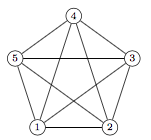
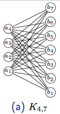
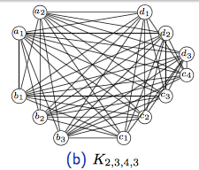

# Grafy

## Úplný graf Kn
Graf, pro který platí, že mezi každými dvěma vrcholy vede hrana. Graf má n vrcholů.

*[1] Graf K5, https://edux.fit.cvut.cz/courses/BI-AG1/_media/lectures/bi-ag1-p1-handout.pdf*

## Úplný bipartitní graf
Graf, který obsahuje dvě partity. V každé platí, že vrcholy nemají mezi sebou **žádné** hrany, ale mají hrany s **každým** vrcholem druhé partity. Značí se Km,n - takový graf má *m* prvků v jedné partitě a *n* v druhé.

*[2] K4,7, https://edux.fit.cvut.cz/courses/BI-AG1/_media/lectures/bi-ag1-p1-handout.pdf*

## Úplný k-partitní graf
Obdobně jako bipartitní graf, k-partitní obsahuje *k* partit v nichž v rámci jedné partity spolu vrcholy nesousedí, ale sousedí se všemi ostatními v grafu.

*[3], K2,3,4,3 https://edux.fit.cvut.cz/courses/BI-AG1/_media/lectures/bi-ag1-p1-handout.pdf*

## Regulární graf
Graf je r-**regulární**, pokud stupeň každého jeho vrcholu je *r*.

## Podgraf
Libovolnou podmnožinu vrcholů grafu *V* a libovolnou podmnožinu hran nazveme podgrafem. Mezi vybranými vrcholy tedy nemusí být všechny hrany z původního grafu.

## Indukovaný podgraf
Vezmu-li libovolnou množinu vrcholů a vvsechny hrany, které tyto vrcholy navzájem propojovali, nazvu ji indukovaným podgrafem grafu *G*.

## Zajímavosti

### Princip sudosti
Pro každý graf *G = (V, E)* platí: součet stupňů všech vrcholů v grafu je roven dvojnásobku počtu hran.
